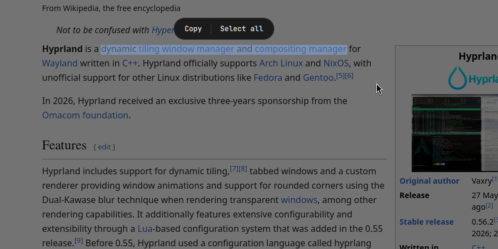

# Scribe for Omarchy

> **This repo is only packaging.** The project itself lives at
> **[lunanoir21/scribe](https://github.com/lunanoir21/scribe)**: source,
> [changelog](https://github.com/lunanoir21/scribe/blob/main/CHANGELOG.md),
> [website](https://lunanoir21.github.io/scribe/), screenshots and the issue tracker are all there.
> Please open bugs and feature requests upstream; issues here are limited to the Omarchy wrapper
> itself (manifest, `Service.qml`, vendoring).

[Scribe](https://github.com/lunanoir21/scribe) packaged as an Omarchy shell plugin. Press a key,
drag a box around any text on the screen (a video, an image, a PDF, a terminal), then drag over the
words and press **Copy**, the way Google Lens does it. The original text stays untouched. Since 0.3.0 it can also
**translate** what it read (off until you switch it on), shows a dictionary bubble when you hover a word,
and turns links, e-mail addresses, phone numbers and IBANs into buttons. Since 0.4.0 you can pick
the animation shown while it reads (settings > **Scan animation**).



This repo is a thin wrapper. All behaviour lives upstream; the `scribe/` directory here is a
vendored, pinned copy of the running module (currently `v0.4.0`, commit
`9cf1321bf05b170087f98f077da15ea8ab72a5c2`, written to `UPSTREAM_COMMIT`), and `Service.qml` is
what Omarchy's plugin loader needs to start it. Nothing is developed here.

`manifest.json` declares `kinds: ["service"]` with `keepLoaded: true`, the same shape as Omarchy's
built-in `background`, `lock` and `notifications` plugins. Scribe draws nothing until you press its
key: the overlay is one full-screen layer window that exists only while it is open, so nothing needs
a place in Omarchy's bar.

## Install

```bash
omarchy plugin add https://github.com/lunanoir21/scribe-omarchy.git --enable
```

Scribe needs a few programs the plugin cannot install for you. On Omarchy (Arch):

```bash
sudo pacman -S --needed grim wl-clipboard tesseract tesseract-data-eng python-numpy python-pillow
```

If something is missing, Scribe says so by name in a notification instead of failing silently. More
languages are added from the gear in the overlay, with a direct download that needs no password
or the exact package manager command.

> **Don't forget the key.** The plugin adds no key on its own, so there is nothing to press until
> you bind one. Run `scripts/bind.sh` from this repo (it asks for a key, or picks a free one such as
> `SUPER + SHIFT + T`), or add the line yourself:

```
bind = SUPER SHIFT, T, exec, qs ipc call scribe start
```

(`scripts/bind.sh` writes into your `bindings.conf` / `bindings.lua` only when *you* run it, and
prints one `STATUS|KEYS|FILE` line.)

## Use

1. Press the key. The screen freezes.
2. Drag a box around the text. A scan line shows it is being read.
3. Drag over the words you want. A toolbar appears above the selection: **Copy**, **Select all** and, when translation is on, **Translate**.

`Ctrl+A` selects everything, `Ctrl+C` or `Enter` copies, `Esc` closes. The gear in the bottom-right
corner opens settings: reading languages (with downloads), behaviour, translation, highlight colour and
the interface language (English or Turkish; `auto` follows `$LANG`).

### Translation (off by default)

In the settings, **Translation > Enable translation** first shows a warning card: the one-time download,
what may be sent, memory and disk use, and that offline translation can be wrong. Only **Enable** turns
it on. Then a **Translate** button appears under the read region. Two views (card with the original
and the translation side by side, or the translation painted over the text), an offline engine
(English and Turkish, on your machine) and an online one (MyMemory, 14 languages, asks before it sends
anything). While it is off, nothing is downloaded, loaded or sent for translation.

Links, e-mail addresses, phone numbers and IBANs found in the text become buttons whether translation is
on or not (a **Smart actions** switch under Behaviour). They only run a small local helper: no model, no
network. Details, screenshots and measured accuracy are in the
[upstream documentation](https://lunanoir21.github.io/scribe/docs.html).

## What it reads and writes

- **Reads** a screenshot of the focused monitor, taken with `grim` into `$XDG_RUNTIME_DIR/scribe`
  (an owner-only directory, mode 700, in RAM). It is deleted when the overlay closes. Scribe refuses
  to run without that directory instead of falling back to `/tmp`.
- **Writes** its settings to `~/.config/scribe/settings.json` (mode 600, known keys with strict
  types and ranges), the language packs you choose to download to `~/.local/share/scribe/tessdata/`,
  the offline translation pack (only after you enabled translation and pressed install) to
  `~/.local/share/scribe-translate/`, and text to the
  clipboard through `wl-copy`, which gets the text on its stdin only: screen text never appears on a
  command line, where other local users could read it. It never touches `~/.config/omarchy/shell.json` or any other
  configuration, and nothing is written inside the plugin folder.
- **Network, translation off (the default):** only the language pack download, and only when you press
  **Download directly**: HTTPS to `github.com` / `raw.githubusercontent.com`
  (`tesseract-ocr/tessdata_fast`), redirects to other hosts refused, a 30 second timeout, a 64 MiB cap
  and a minimum size.
- **Network, translation on:** installing the offline pack (only when you press install) downloads
  PyPI packages at pinned versions as wheels only (`pip --only-binary=:all: --isolated`, no `setup.py`
  runs) and two models from `argos-net.com` over HTTPS: one host, redirects elsewhere refused, a
  200 MiB cap, and the SHA-256 of each file must match the value in the code before anything is
  unpacked. The online engine sends the text you translate to `api.mymemory.translated.net`, and only
  after you chose **Send once** or **Always allow**. Links, e-mail addresses and IBANs are replaced by
  placeholders first and never leave your computer. No telemetry, no update check.
- **Privileges:** none. For a package manager install Scribe only *shows* the command and can
  type it into your own terminal, where you enter the password. Nothing is piped to a shell. The
  translation pack installs into your home directory and needs no root.
- **Processes:** `grim`, `tesseract` (one per strip of the selection, each with a 60 second timeout),
  `wl-copy`, `notify-send`, short Python helpers (`translate.py` gets text on stdin only) and, for a link
  or e-mail address you click, `xdg-open` after its scheme was checked (`http`, `https`, `mailto`). With
  translation on, a small service keeps the model in memory (260 to 440 MB, only after you press
  Translate) and quits after two idle minutes; its socket is in `$XDG_RUNTIME_DIR` with mode 600. It
  starts no second Quickshell instance.
- **Limits:** the selection is capped at 36 megapixels, at most 4000 words come back, the output of
  the reader is cut at 4 MiB, and a read that runs longer than 90 seconds is cancelled. Translation
  input is cut at 256 KiB.

The upstream [SECURITY.md](https://github.com/lunanoir21/scribe/blob/main/SECURITY.md) has the full
list, and its test suite (`python3 -m unittest discover -s tests`) checks these rules.

## Uninstall

```bash
omarchy plugin remove io.github.lunanoir21.scribe
```

Your settings stay in `~/.config/scribe/`, downloaded language packs in
`~/.local/share/scribe/` and the offline translation pack in `~/.local/share/scribe-translate/` (also
removable with **Remove** in the settings); delete them if you want them gone. Remove the key bind line (marked
`scribe-omarchy`) from your bindings file too if you added one.

## Requirements

- Quickshell 0.3+ with Qt 6.6+ on a Wayland compositor with layer-shell (Hyprland on Omarchy)
- `grim`, `wl-clipboard` (`wl-copy`), `tesseract` with at least one language pack, Python 3 with
  `numpy` and `pillow`. Only for offline translation: `python3 -m venv` and about 470 MB (installed from
  the settings, never by the plugin itself)
- Optional: `notify-send` (error messages), a terminal (to run a package manager command from the
  settings)

## Updating the vendored copy

`scribe/` is a plain copy, not a git submodule: Omarchy's marketplace clones a single ref of this
repo, and a submodule would need an extra `--recurse-submodules` step outside the plugin loader's
control. To pick up a new release:

```bash
git -C ../scribe pull && scripts/sync.sh      # copies from ../scribe and pins its HEAD
# bump "version" in manifest.json and the commit above, then commit
scripts/sync.sh --check                        # verify against the pinned upstream commit
```

CI runs the same check, so the two repos cannot drift apart unnoticed. Watch the
[upstream releases](https://github.com/lunanoir21/scribe/releases).

## License

MIT, same as upstream; see [LICENSE](LICENSE).

---

<sub>Maintainer note: marketplace submission: category `Productivity`, tags `hyprland`, `quickshell`.
`preview.png` is the project's cover image (1280×640).</sub>
